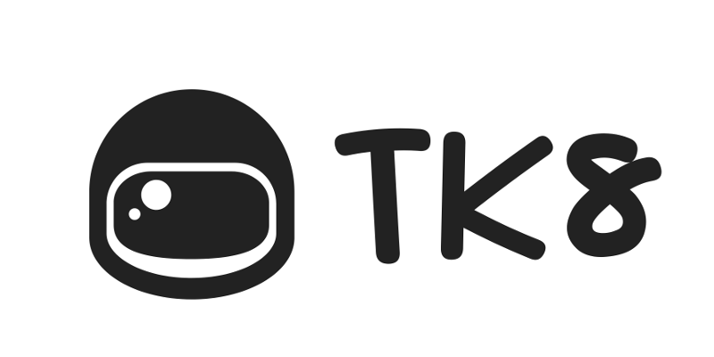

# TK8: A multi-cloud, multi-cluster Kubernetes platform installation and integration tool

TK8 is a command line tool written in Go. It fully automatates the installation of Kubernetes on any environment. With TK8, you are able to centrally manage different Kubernetes clusters with different configurations. In addition, TK8 with its simple add-on integration offers the possibility to quickly, cleanly and easily distribute extensions to the different Kubernetes clusters.

These include a Jmeter cluster for load testing, Prometheus for monitoring, Jaeger, Linkerd or Zippkin for tracing, Ambassador API Gateway with Envoy for Ingress and Load Balancing, Istio as mesh support solution, Jenkins-X for CI/CD integration. In addition, the add-on system also supports the management of Helm packages.

## Table of contents

The documentation as well as a detailed table of contents can be found here.

* [Table of content](docs/en/SUMMARY.md)

## Installation

The TK8 CLI requires some dependencies to perform its tasks.
At the moment we still need your help here, but we are working on a setup script that will do these tasks for you.

### Terraform

Terraform is required to automatically set up the infrastructure in the desired environment.
[Terraform Installation](https://www.terraform.io/intro/getting-started/install.html)

### Ansible

Ansible is required to run the automated installation routines in the desired and created environment.
[Ansible Installation](https://docs.ansible.com/ansible/2.5/installation_guide/intro_installation.html#installing-the-control-machine)

### Kubectl

Kubectl is needed by the CLI to roll out the add-ons and by you to access your clusters.
[Kubectl Installation](https://kubernetes.io/docs/tasks/tools/install-kubectl/)

### Python and pip

In the automated routines Python scripts are used which uses Pip to load its dependencies.
[Python Installation](https://www.python.org/downloads/)
[pip Installation](https://pip.pypa.io/en/stable/installing/)

### AWS IAM Authenticator

If you want to install an EKS cluster with TK8, the [AWS IAM Authenticator](https://github.com/kubernetes-sigs/aws-iam-authenticator) needs to be available on your system and must be executable `(chmod +x <path-to-binary>)`. It is preffered to have the binary in your `$PATH` location e.g: `(/usr/local/bin)`. This is included in the provisioner package EKS of the TK8 CLI or can be found in the given link.

## Usage

We have described the different target platforms separately in detail in the documentation. But we would like to give you just one example using AWS.

You can get the binary in following ways:
* Download the executable file for your operating system from the [release section](https://github.com/kubernauts/tk8/releases).
* Use `go get -u github.com/kubernauts/tk8` to let `go` fetch the repo along with its dependencies and build the executable for you.
* Build your own version using the `go build` command.

Create a separate folder and store the executable binary file there, a configuration file is also required. An example config file is available by the name [config.yaml.example](config.yaml.example). Add the necessary parameters for your cluster along with the AWS API credentials. Alternatively you should export the AWS API credentials in the environment variables because parts of the CLI (EKS cluster) needs them there.

`export AWS_SECRET_ACCESS_KEY=xxx`
`export AWS_ACCESS_KEY_ID=xxx`

Then execute the CLI with the command:
`tk8 cluster install aws`

With this command the TK8 CLI will create all of the required resources in AWS and installs Kubernetes on it.

If you no longer need the cluster, you can use the command:
`tk8 cluster destroy aws`
to automatically remove all of the resources.

## Rest API

TK8 can now run as a server rather than from the command line.
For usage details on rest api. Checkout the link [REST-API](https://github.com/kubernauts/tk8/REST-API-README.md)

## Add-Ons

You might want to check out our numerous add-ons for TK8: 

- [Jenkins](https://github.com/kubernauts/tk8-addon-jenkins)
- [Rancher](https://github.com/kubernauts/tk8-addon-rancher)
- [SonarQube](https://github.com/kubernauts/tk8-addon-sonarqube)
- [GoCD](https://github.com/kubernauts/tk8-addon-gocd)
- [Elasticsearch-Fluentd-Kibana](https://github.com/kubernauts/tk8-addon-efk)
- [Pumba](https://github.com/kubernauts/tk8-addon-pumba)
- [Heptio Contour](https://github.com/kubernauts/tk8-addon-contour)
- [Traefik](https://github.com/kubernauts/tk8-addon-traefik)
- [Argo CD](https://github.com/kubernauts/tk8-addon-argocd)
- [Ambassador](https://github.com/kubernauts/tk8-addon-ambassador)
- [CoreOS-Kube-Prometheus Stack](https://github.com/kubernauts/tk8-addon-kube-prometheus)
- [Velero Minio](https://github.com/kubernauts/tk8-addon-velero-minio)
- [CoreOS Vault operator](https://github.com/kubernauts/tk8-addon-vault-operator)

Stay tuned as there is more to come from our lovely community and ourselfs! You can also develop your own add-ons, just check the passage below

## Contributing

For provisioning the add-ons we have a separate [documentation](docs/en/add-on/introduction.md) and [examples](https://github.com/kubernauts/tk8-addon-develop) how you can build your extensions and integrate them into the TK8 project. You can also reach us at Slack.

For a platform provider we have a separate [documentation](docs/en/add-on/development.md) which is only about integrating a platform in TK8. Here you will find detailed instructions and examples on how TK8 will execute your integration or you can also reach us in slack.

To join the community and participate in the discussions going around, you can create an issue or get in touch with us in Slack.

[Join us on Kubernauts Slack Channel](https://kubernauts-slack-join.herokuapp.com/)

## Credits

Founder and initiator of this project is [Arash Kaffamanesh](https://github.com/arashkaffamanesh) Founder and CEO of [Clouds Sky GmbH](https://cloudssky.com/de/) and [Kubernauts GmbH](https://kubernauts.de/en/home/)

The project is supported by cloud computing experts from cloudssky GmbH and Kubernauts GmbH.
[Christopher Adigun](https://github.com/infinitydon),
[Arush Salil](https://github.com/arush-sal),
[Manuel Müller](https://github.com/MuellerMH),
[Nikita](https://github.com/niki-1905),
[Anoop](https://github.com/anoopl)

A big thanks goes to the contributors of [Kubespray](https://github.com/kubernetes-incubator/kubespray) whose great work we use as a basis for the setup and installation of Kubernetes in the AWS Cloud.

Furthermore we would like to thank the contributors of [kubeadm](https://github.com/kubernetes/kubernetes/tree/master/cmd/kubeadm) which is currently not only part of the Kubespray project, but also of the TK8.

Also a big thank you to [Wesley Charles Blake](https://github.com/WesleyCharlesBlake), on the basis of which we were able to offer our EKS integration.

## License

[Tk8 Apache License](LICENSE)
[MIT License EKS](https://github.com/kubernauts/tk8eks/blob/master/LICENSE-Wesley-Charles-Blake)
[MIT License EKS](https://github.com/kubernauts/tk8eks/blob/master/LICENSE)
