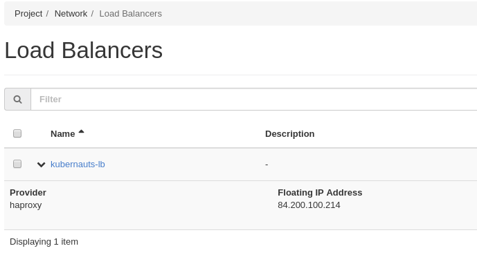

# TK8: A multi-cloud, multi-cluster Kubernetes platform installation and integration tool with HA support!

## Problem Statement

How do I deploy an HA'ed Vanilla Kubernetes in an uniform and homogenous way on any operating system of my choice with a single line on Bare-Metall, OpenStack, Google Cloud, AWS Cloud or Microsoft Cloud? And integrate other add-ons for monitoring, load testing, networking, tracing, security scanners or storage with ease?

## Solution

TK8 is a CLI written in Golang to deploy the upstream Vanilla Kubernetes fully automated using Terraform, Kubespray and Ansible on any environment. **We'll provide kubeadm support as soon kubeadm HA support is available.**

With TK8 you can also install additional add-ons such as a Jmeter Cluster for load testing, Prometheus for monitoring, Jaeger, Linkerd or Zippkin for tracing, Ambassador API Gateway with Envoy for ingress and load balancing, Istio for service mesh support , Jenkins-X for CI/CD and Helm or Kedge for packaging on Kubernetes.

This release supports the Kubernetes installation on AWS and OpenStack / Bare-Metal with HA capabilities.

N.B: MS Azure and GCP support will be added in the very near future.

## Kubernetes Deployment with TK8 on AWS

After cloning the repo you'll build a docker image which contains Terraform and Ansible and the tk8 binary for linux.

If you're on mac or would like to build your own tk8 cli on linux, you've to build tk8 with "go build .".

```
git clone https://github.com/kubernauts/tk8.git

docker build -t tk8 ./tk8/.

vi ./tk8/config.yaml
```

--&gt; pls. provide the aws access and secret keys, your ssh keypair name and your desired aws region

N.B: create a key pair in aws with your public key \(id\_rsa.pub\)

```
docker run -it -d -v "$(pwd)"/tk8:/tk8 tk8

alias dl='docker ps -l -q'

docker exec -it $(dl) bash

vi /root/.ssh/id_rsa --> paste yor private key in id_rsa in the container

chmod 400 /root/.ssh/id_rsa

tk8 cluster init
```

--&gt; kubespray will be cloned

```
tk8 cluster aws -c
```

--&gt; terraform brings up 2 bastion hosts and the master and worker nodes as specified in config.yaml, please wait till the hosts are initialized

```
tk8 cluster aws -i
```

--&gt; kubespray installs kubernetes

```
tk8 cluster aws -d
```

--&gt; destroy the cluster

Note: For AWS deployment you can get the kubeconfig by checking the following location after the kubernetes installation finishes: _**./tk8/kubespray/inventory/awscluster/artifacts/admin.conf**_

```
tk8 addon -l
```

--&gt; installs jmeter on top of your new cluster

```
tk8 -h
```

--&gt; provides the help

## Kubernetes Deployment with TK8 on OpenStack

### Step 1:

Clone the TK8 repo and initialize the kubespray repo also if it has not been done yet

git clone [https://github.com/kubernauts/tk8](https://github.com/kubernauts/tk8)

```
cd tk8/

./tk8 cluster init
```

### Step 2:

Adjust the following openstack files with your specific settings:

_**~/tk8/openstack/cluster.tfvars**_ -- This file contains the parameters for the cloud components to be deployed e.g flavor, image, cluster\_name, external network id \(float network\), number of masters, number etcd nodes, number of worker nodes etc. Some values have been set but some needs to be modified to suit your environment like the image, flavor \(this is the ID not name\) and external network id.

The elb\_api\_fqdn domain name should be set to a value that you can resolve within your network/deployment, this will should be resolvable to the load balancer VIP address of the master nodes i.e. Floating IP address \(you can check the load balancer on Horizon or openstack CLI to check the value of the Load Balancer floating IP address for the master nodes\). Snapshot is given below:



N.B -- Currently you can only use Centos 7 image \(image can be downloaded from the centos public repo\), Ubuntu and Coreos will be added soon.

Also make sure you use the right set of SSH keys, you are to use the SSH public key that you used to create the key pair on Openstack, otherwise the kubernetes installation will not be able to access the VMs via ssh.

_**~/tk8/openstack/stack\_credentials.yaml**_  -- This file contains your openstack credentials, modify as per your openstack deployment.

### Step 3:

Create the infrastructure with the following command:

```
./tk8 cluster openstack -c
```

### Step 4:

Install kubernetes on the infrastructure that was created with the following command:

```
./tk8 cluster openstack -i
```

For the Openstack deployment, you can get the kubeconfig by checking the following location after the kubernetes installation finishes: _**./tk8/kubespray/inventory/stackcluster/artifacts/admin.conf**_

### Step 5:

Destroy the infrastructure, use the following command:

```
./tk8 cluster openstack -d
```

N.B -- Before destroying the cluster, make sure you delete any load balancer that was created inside your kubernetes cluster, otherwise, terraform destroy will not work completely since terraform did not create the additional load balancer \(the load balancer is tied to some other aspects of the cloud which will affect the terraform destroy procedure\).

