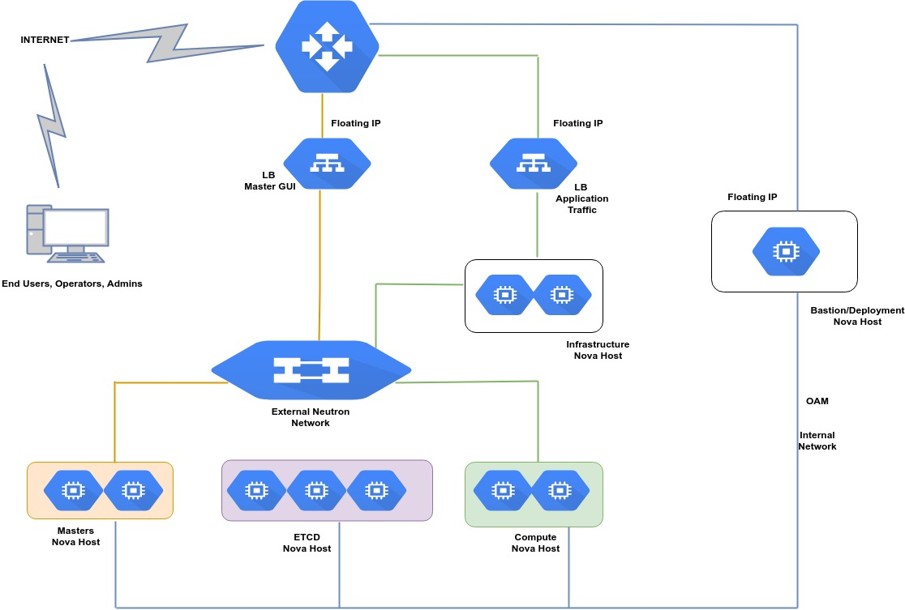
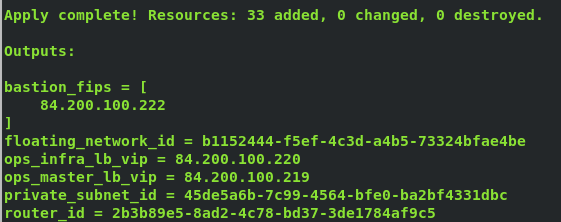
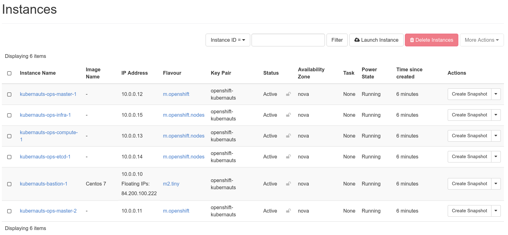
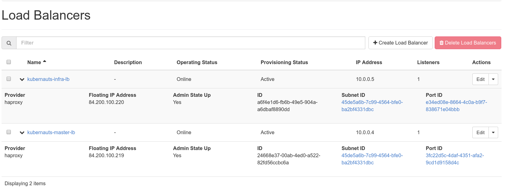
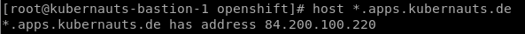
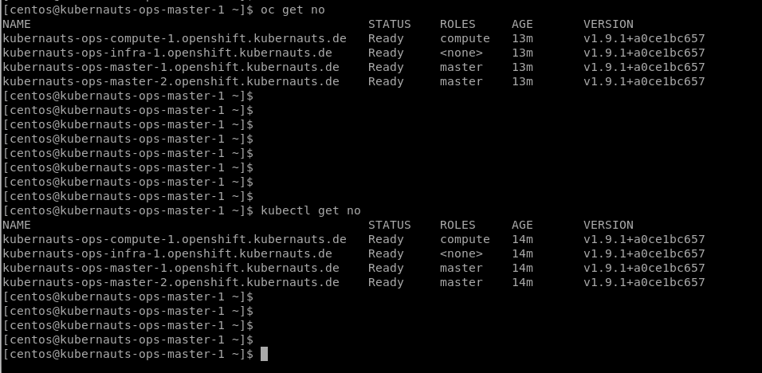

# Overview

The purpose of this documentation is to provide a reference guide for installing an HA’ed OpenShift Origin deployment on an OpenStack cloud infrastructure using the Openshift-Ansible deployment method, which is the basis for our TK8 installer for the OpenShift version.

This is aimed at enterprise environment, hence the need to include necessary components that meets this standard. If the interest is on stand-alone deployment there are several ways to do this, we implore the reader to check resources like mini-shift which can satisfy stand-alone deployments which are to used for testing or learning purposes.

## Prerequisite

A working OpenStack environment is needed with support for LBaaS feature, any recent OpenStack version supports this, you should be fine with Mitaka and later versions.

The following softwares are needed to have a successful deployment, these must be installed on the Deployment host:

* Ansible
* Terraform
* Python-netaddr
* Jinja2

Basic Linux administration skill is needed.

DNS is needed for proper resolution of all the hostnames of the nodes including the domain name of the master and application endpoint URLs (the openshift router).

If name resolution fails, the installation will fail along the way.

## Reference Architecture



**N.B**: The number of actual virtual machines will be different based on the final design architecture, the above is given as an example.

Below gives a brief description about the components:

* Master Nova Hosts:  These are the master virtual machines that are dedicated for the control aspects, this is where the controllers, APIs etc will reside, having more than one is highly encouraged for HA (even though they will not processing any payload services).

* ETCD Nova Hosts: These are the virtual machines that will be dedicated to the key/value store, an odd number is required for quorum to be established.

* Compute Nova Hosts: These are the virtual machines that will be dedicated for running the application containers.

* Infrastructure Nova Hosts: These are the virtual machines that will be dedicated to running infrastructure services like the Docker registry and Openshift routing functionality.

* LB: These are the load balancers that will be based on the LBaaS functionality of OpenStack. One LB is dedicated for the Master nodes (to access the GUI) while another is dedicated to the infrastructure nodes.

**N.B**: The Load Balancer for the infrastructure nodes only exposes HTTPS port, put this in mind when creating routers for your application endpoints.

* Bastion Nova Host: This will be used as a jump host to the Openshift VMs, this is aligning with best security practices so that the VMs are not exposed directly to the internet. Also the actual installation will be initiated from here (i.e. it will be used as the deployment host).

## Infrastructure Deployment

The infrastructure will be created using terraform, the following terraform modules are available:

* Compute: Used to create the Nova compute VMs

* Network: Used to create Neutron networks

* IP: Used to create the needed floating IPs

* LB: To create the Load balancers

Your OpenStack credentials will be needed, this will be used in the `clouds.yaml` file (this is following the OpenStack recommended procedure for using your credentials to manage OpenStack).

Below are the steps to create the infrastructure nodes using terraform:

1; Clone the Openshift terraform github:

```shell
git clone https://github.com/kubernauts/openshift-OpenStack
```

2; Edit the `clouds.yaml` file with respect to your OpenStack credentials

3; Modify `cluster.tfvars` with details about your OpenStack inventories like the flavour, external network name, Operating system image, proposed cluster name, path to your SSH public key, volume size, elb_api_fqdn (domain for the openshift master GUI access), openshift_master_default_subdomain (application endpoint via Openshift router), etc

4; Initialize terraform:

```shell
terraform init
```

5; You can preview the changes that will be applied:

```shell
terraform plan -var-file=cluster.tfvars
```

6; Create the infrastructure nodes:

```shell
terraform apply -var-file=cluster.tfvars
```

Successful output should be similar to below snapshot:







7; Ensure you are able to resolve the all the node hostnames to their respective private IPs, the DNS solution is dependent on your specific environment.


On your DNS configure the master FQDN to resolve to the public IP of the master LB. Sample resolution is given below:


Also configure application URL endpoint FQDN to resolve to the public IP of the infrastructure node LB. Sample resolution is given below:



## Openshift Origin Installation

The installation is done using Ansible with the respective playbooks. The steps are given below:

1; Clone the Openshift-Ansible repository:

```shell
git clone -b release-3.9 https://github.com/openshift/openshift-ansible.git
```

**N.B**: Don’t clone the master branch, this is always been updated and it is very likely that it has not been tested properly, hence the reason to specify the release version.

2; Copy the `hosts.ini` file from the openshift folder to `/openshift-ansible/inventory/` (the terraform scripts will have helped out in filling out most of the parameters):

```ini
[all]
mercy-ops-master-1 ansible_host=10.0.0.8
mercy-ops-infra-1 ansible_host=10.0.0.14
mercy-ops-compute-1 ansible_host=10.0.0.12
mercy-ops-compute-2 ansible_host=10.0.0.15
mercy-ops-etcd-1 ansible_host=10.0.0.13

[OSEv3:children]
masters
nodes
etcd

# Set variables common for all OSEv3 hosts
[OSEv3:vars]
ansible_ssh_user="centos"
openshift_deployment_type="origin"
enable_excluders=false
ansible_become=true
openshift_release=3.9
openshift_disable_check=docker_storage
openshift_repos_enable_testing=true

# Uncomment the following to enable htpasswd authentication; defaults to
# DenyAllPasswordIdentityProvider.
openshift_master_identity_providers=[{'name': 'htpasswd_auth', 'login': 'true', 'challenge': 'true', 'kind': 'HTPasswdPasswordIdentityProvider', 'filename': '/etc/origin/master/htpasswd'}]
# Native high availability cluster method with optional load balancer.
# If no lb group is defined installer assumes that a load balancer has
# been preconfigured. For installation the value of
# openshift_master_cluster_hostname must resolve to the load balancer
# or to one or all of the masters defined in the inventory if no load
# balancer is present.
openshift_master_cluster_method=native
openshift_master_cluster_hostname="mercy.kubernauts.de"
openshift_master_cluster_public_hostname="mercy.kubernauts.de"
openshift_master_default_subdomain="app.kubernauts.de"
openshift_disable_check=disk_availability,memory_availability

# host group for masters
[masters]
mercy-ops-master-1

# host group for nodes, includes region info
[nodes]
mercy-ops-master-1
mercy-ops-infra-1 openshift_node_labels="{'region': 'infra', 'zone': 'default'}"
mercy-ops-compute-1 openshift_node_labels="{'region': 'primary', 'zone': 'east'}"
mercy-ops-compute-2 openshift_node_labels="{'region': 'primary', 'zone': 'east'}"

# host group for etcd
[etcd]
mercy-ops-etcd-1
```

Make sure that your `host.ini` file is aligned with the above example, the only thing that will different will be actual hostnames for the nodes which will be according to what you have configured in the `clusters.tfvars` file.

If the node labels are not properly configured then you might end with a broken installation.

3; Prepare the nodes by running the NetworkManager and pre-requisite playbooks:

```shell
ansible-playbook -i ./openshift-ansible/inventory/hosts.ini ./openshift-OpenStack/openshift/network_manager.yml \
    -e ansible_user=centos -b --become-user=root --flush-cache
shell
ansible-playbook -i ./openshift-ansible/inventory/hosts.ini ./openshift-ansible/playbooks/prerequisites.yml \
    -e ansible_user=centos -b --become-user=root --flush-cache
```

4; Finally initiate the installation of the Openshift cluster:

```shell
ansible-playbook -i /openshift-ansible/inventory/hosts.ini ./openshift-ansible/playbooks/deploy_cluster.yml -e ansible_user=centos -b --become-user=root --flush-cache
```

If everything goes on fine, you should an output like the one below:


## Post-Installation

1; Check the status of the Openshift cluster:



2; Generate admin username/password (this will be done on the master node) that will be used to access the webpage:

```shell
[root@origin-master ~]# sudo htpasswd -c /etc/origin/master/htpasswd admin
New password:
Re-type new password:
Adding password for user admin
```

> Note: The tk8 cli doesn't support openshift yet due to some shortcomings by terraform to create the inventory file.
